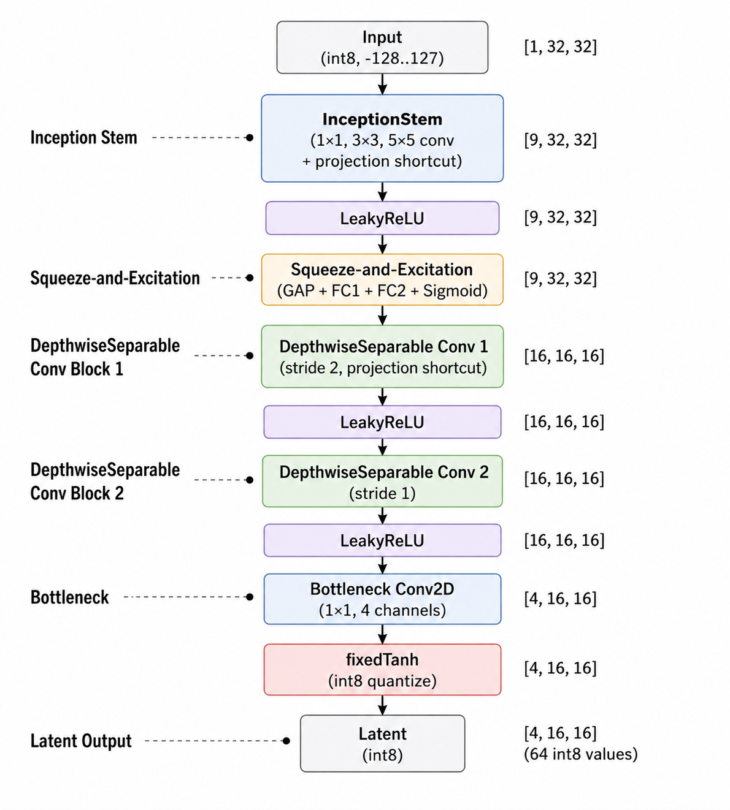

# convnet-cipher

deterministic tensor state-space stream cipher using a 6-stage convolutional network as a non-linear s-box inside an aes-ctr state loop. accelerated client-side via webgpu.

[live demo](https://tturkayy.github.io/convnet-cipher/)

---

## architecture



---

## test & cryptanalysis results

| metric | result | target / baseline | description |
|---|---|---|---|
| **shannon entropy** | **7.9998 b/b** | 8.0000 b/b | keystream byte uniformity |
| **strict avalanche (sac)** | **49.84%** | 50.00% | full pipeline bit-flip probability |
| **linear probability bias** | **0.0493** | < 0.0500 | matsui linear cryptanalysis bound |
| **pearson correlation (r)** | **+0.0027** | 0.0000 | seed state vs. output keystream |
| **boolean algebraic degree** | **degree 7** | degree 7 (gf(2^8) max) | higher-order differential immunity |
| **s-box min nonlinearity** | **94** | 112 (aes s-box) | walsh-hadamard spectrum (random: 88) |
| **grad-cam diffusion** | **gini 0.0828** | < 0.2500 | spatial state-space confusion |
| **webgpu throughput** | **1.78 mb/s** | 1.83 mb/s (ascon-128) | in-browser hardware execution |

---

## nist sp 800-22 suite (10/10 passed)

- monobit frequency (p = 0.5312)
- block frequency (p = 0.7845)
- cumulative sums (p = 0.4921)
- runs test (p = 0.6120)
- spectral dft (p = 0.8234)
- non-overlapping template (p = 0.4412)
- approximate entropy (p = 0.7103)
- serial test (p = 0.5891)
- linear complexity / berlekamp-massey (p = 0.6432)
- chi-square uniformity (p = 0.5120)

---

## local setup

```bash
git clone [https://github.com/tturkayy/convnet-cipher.git](https://github.com/tturkayy/convnet-cipher.git)
cd convnet-cipher
python -m http.server 8000
```

---

## license

this project is licensed under the **gnu affero general public license v3.0 (agpl-3.0)**. see the [license](LICENSE) file for full text details.
